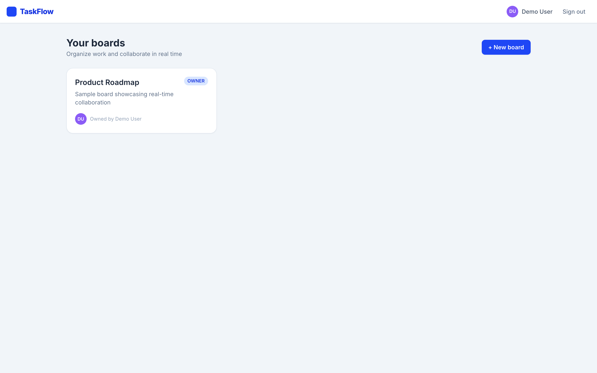
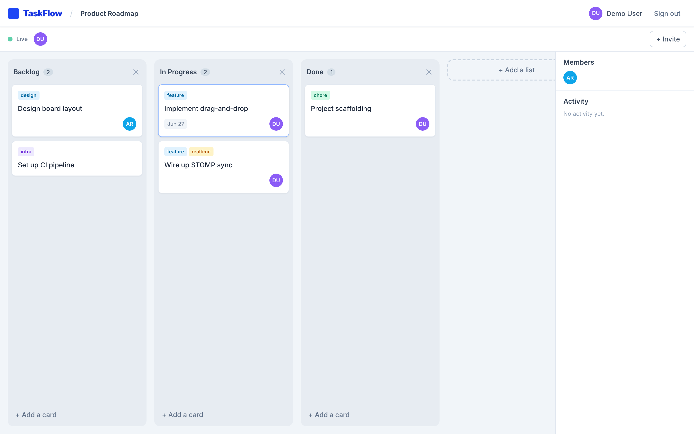

# TaskFlow

> A real-time, collaborative Kanban board — drag a card and watch it move on everyone else's screen instantly.

[](https://github.com/your-org/taskflow/actions/workflows/ci.yml)


TaskFlow is a Trello-style task manager built to demonstrate production-grade full-stack
engineering: a layered Spring Boot API, role-based access control, JWT authentication, and
**live multi-user synchronization over WebSocket/STOMP**. When one collaborator moves, edits,
creates, or deletes a card, every other person viewing the board sees the change in real time —
no refresh, no polling.

---

## Why this project

Most CRUD demos stop at "save and reload." TaskFlow tackles the parts that are genuinely hard
in collaborative software:

- **Real-time STOMP sync.** Every board mutation is broadcast to `/topic/boards/{id}`. Clients
  fold incoming events into a normalized client cache with a pure reducer, so UIs stay
  consistent without re-fetching.
- **Optimistic drag-and-drop.** Cards reorder and cross columns instantly via `@dnd-kit`; the
  move is persisted in the background and reconciled with server truth on failure.
- **Fractional ordering.** Positions are stored as floating-point midpoints, so a move touches a
  **single row** instead of renumbering the whole column — and the same code path handles
  reorder-within-list and move-across-lists.
- **Server-side RBAC.** Authorization is enforced on every mutating endpoint based on board
  role (OWNER / MEMBER / VIEWER). A viewer literally cannot mutate the board, even if the UI is
  bypassed.
- **Secured WebSocket handshake.** The STOMP `CONNECT` frame is authenticated with the same JWT
  as the REST API via a channel interceptor.

---

## Features

- 🔐 **Auth** — register / login with BCrypt password hashing and stateless JWT.
- 📋 **Boards, lists, cards** — full CRUD with titles, descriptions, assignees, labels, due dates.
- 🧲 **Drag-and-drop** — reorder cards within a list and move them across lists; positions persist.
- ⚡ **Real-time collaboration** — card/list create/move/update/delete broadcast live via STOMP.
- 👀 **Presence indicator** — avatars of everyone currently viewing the board.
- 👥 **Team roles** — invite members as MEMBER (edit) or VIEWER (read-only); RBAC enforced server-side.
- 🕓 **Activity feed** — a per-board log of who did what.
- 📖 **OpenAPI / Swagger UI** — interactive API docs out of the box.
- 🌱 **Seeded demo data** — a sample board with lists and cards on first run (dev profile).

---

## Architecture

```
                       ┌──────────────────────────────────────────────┐
                       │                 Frontend (SPA)                │
                       │   React 18 · TypeScript · Vite · Tailwind     │
                       │   TanStack Query · @dnd-kit · @stomp/stompjs  │
                       └───────────────┬───────────────┬──────────────┘
                                       │               │
                           REST (axios)│               │ WebSocket / STOMP
                        JWT Bearer auth │               │ (SockJS fallback)
                                       ▼               ▼
                       ┌──────────────────────────────────────────────┐
                       │              Spring Boot 3.3 (Java 21)        │
                       │                                                │
                       │  Controllers ──► Services ──► Repositories     │
                       │      │              │              │           │
                       │  DTO/Mapper   BoardAccess (RBAC)  Spring Data  │
                       │      │        PositionService      JPA         │
                       │  JWT filter   ActivityService       │          │
                       │  Security     ┌──────────────┐      │          │
                       │  config       │ BoardEvent   │      │          │
                       │               │ Publisher    │──────┼──► /topic│
                       │               └──────────────┘      │   /boards│
                       └───────────────────────────────────┬─┴─────────┘
                                                            │
                                                            ▼
                                                 ┌─────────────────────┐
                                                 │   PostgreSQL 16     │
                                                 │   (H2 in tests)     │
                                                 └─────────────────────┘
```

A mutating REST call updates the database **and** publishes a `BoardEvent` to the board's STOMP
topic. The originating client applies the response optimistically; all other subscribers receive
the broadcast and reconcile their cache — that is the live-sync loop.

---

## Tech stack

| Layer        | Technology |
|--------------|------------|
| Backend      | Java 21, Spring Boot 3.3 (Web, Data JPA, Security, Validation, WebSocket) |
| Auth         | JWT (jjwt 0.12), BCrypt, stateless `SecurityFilterChain` |
| Persistence  | PostgreSQL 16 + Flyway migrations; H2 (PostgreSQL mode) for tests |
| Real-time    | Spring WebSocket + STOMP, SockJS fallback, JWT-secured handshake |
| API docs     | springdoc-openapi (Swagger UI) |
| Frontend     | React 18, TypeScript, Vite, React Router v6 |
| Data / state | TanStack Query, axios |
| UI           | Tailwind CSS, @dnd-kit (drag-and-drop), @stomp/stompjs |
| Testing      | JUnit 5, Mockito, Spring MVC Test (backend); Vitest + Testing Library (frontend) |
| CI           | GitHub Actions (Maven verify + Vite build + tests) |

---

## Screenshots

> Add images to `docs/screenshots/` and they will render here.

| Boards | Board view |
|--------|------------|
|  |  |

---

## Getting started

### Prerequisites

- Java 21 and Maven 3.9+
- Node.js 20+
- Docker (optional, for PostgreSQL or full stack)

### 1. Configure environment

```bash
cp .env.example .env
# adjust DB credentials / JWT secret if desired
```

### 2. Start PostgreSQL

```bash
docker compose up -d postgres
```

### 3. Run the backend

```bash
cd backend
SPRING_PROFILES_ACTIVE=dev mvn spring-boot:run
```

The `dev` profile seeds a demo board. Log in with:

```
demo@taskflow.dev  /  password123
```

The API runs at <http://localhost:8080>.

### 4. Run the frontend

```bash
cd frontend
npm install
npm run dev
```

Open <http://localhost:5173>. The Vite dev server proxies `/api` and `/ws` to the backend.

### Run everything with Docker

```bash
docker compose up --build
# frontend → http://localhost:5173, backend → http://localhost:8080
```

---

## API documentation

Interactive Swagger UI: **<http://localhost:8080/swagger-ui.html>**
OpenAPI JSON: **<http://localhost:8080/v3/api-docs>**

Authenticate via `POST /api/auth/login`, then click **Authorize** and paste the JWT.

---

## Testing

```bash
# Backend — JUnit 5, Mockito, MVC integration tests on H2
cd backend && mvn verify

# Frontend — Vitest + Testing Library
cd frontend && npm test
```

The backend suite covers the fractional position algorithm, RBAC role resolution
(a VIEWER cannot mutate), and a full controller integration flow (register → board → list →
card → move → read-back). The frontend suite covers the realtime cache reducer and UI helpers.

---

## Key engineering highlights

- **Single move algorithm.** `PositionService.between(before, after)` returns a midpoint, so card
  reorder and cross-list moves share one path and one DB write — no column renumbering.
- **Pure realtime reducer.** `applyBoardEvent` is a side-effect-free fold from `(state, event)`
  to new state, which makes live sync trivial to unit-test and reason about.
- **Defense-in-depth authorization.** A central `BoardAccessService` resolves the caller's role
  and gates every operation (`requireViewer` / `requireMember` / `requireOwner`); the UI hides
  controls, but the server is the source of truth.
- **End-to-end JWT.** The same token authenticates REST requests (via a `OncePerRequestFilter`)
  and the STOMP handshake (via a `ChannelInterceptor`), so WebSocket traffic is never anonymous.
- **Structured errors.** A global `@RestControllerAdvice` returns consistent JSON
  (`timestamp`, `status`, `message`, `fieldErrors`) for validation and domain failures.
- **CI-friendly persistence.** Production runs on PostgreSQL with Flyway; tests run on in-memory
  H2 in PostgreSQL-compatibility mode, so the suite is fast and needs no Docker.

---

## Project structure

```
taskflow/
├── backend/                 # Spring Boot API
│   └── src/main/java/com/taskflow/
│       ├── config/          # security, OpenAPI
│       ├── controller/      # REST endpoints
│       ├── service/         # business logic, RBAC, ordering
│       ├── repository/      # Spring Data JPA
│       ├── entity/          # JPA entities
│       ├── dto/ · mapper/   # API contracts
│       ├── security/        # JWT filter, principal, user details
│       ├── websocket/       # STOMP config, auth interceptor, publisher
│       └── exception/       # global error handling
├── frontend/                # React + Vite SPA
│   └── src/
│       ├── api/ · hooks/     # axios client, STOMP hook
│       ├── context/          # auth provider
│       ├── pages/ · components/
│       └── lib/              # realtime cache reducer
├── docker-compose.yml
└── .github/workflows/ci.yml
```

---

## License

MIT
